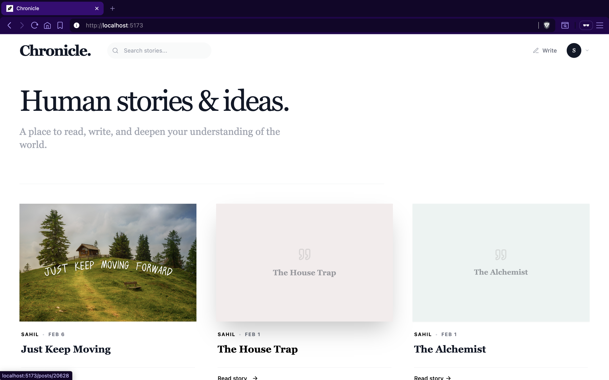
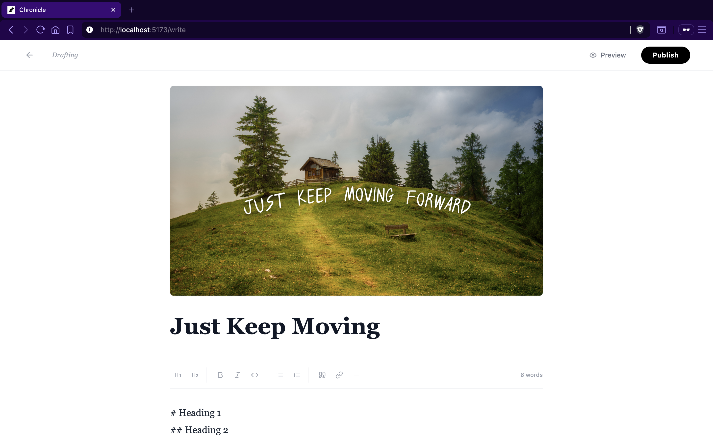
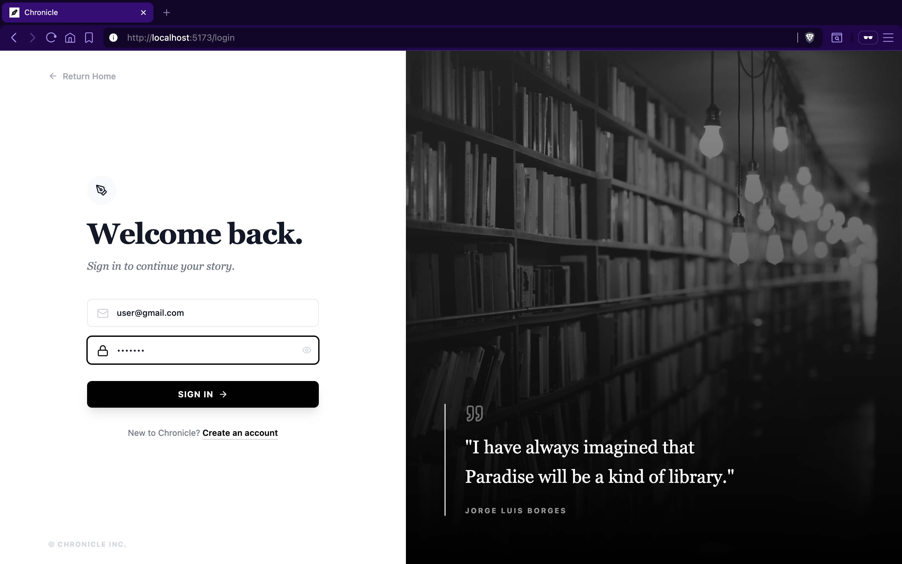
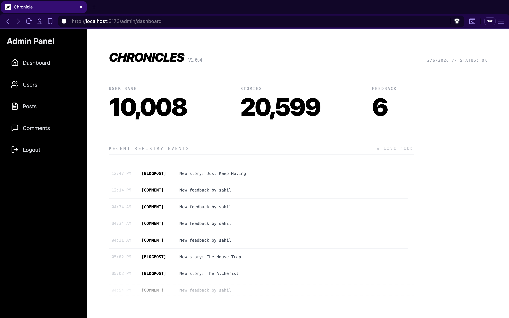

# ⚡ Chronicle


> **A high-performance, full-stack blogging platform engineered for scale**  
> _Built and validated through a **20,000-post stress test engineering challenge**_

---

## 📖 About the Project

**Chronicle** is **not** a CRUD demo.

It is a **production-oriented content platform** built to tackle real backend engineering problems:

- High-volume data access
- Pagination correctness at scale
- Cache efficiency
- Database performance bottlenecks
- Observability under load

To validate the architecture, the system was stress-tested with:

- **20,000+ blog posts**
- **10,000+ users**

The backend was optimized to deliver **sub-millisecond responses** under load.

---

## 🚀 Key Engineering Highlights

### 🔁 Infinite Scroll Engine
- Custom **cursor-based pagination**
- Handles 20,000+ records without duplicates or missing records

### ⚡ Redis Caching Strategy
- **Write-Through** and **Look-Aside** caching
- Reduced API latency from **~200ms → <15ms**

### 🧠 Optimized Database Access
- Eliminated **N+1 query issues**
- Custom JPQL with `LEFT JOIN FETCH`
- Indexed read-heavy tables

### 📊 Observability
- Prometheus & Grafana integration
- JVM, threads, and HTTP metrics

---

## 🛠️ Tech Stack

### Backend
- Spring Boot 3.4.2
- Java 17
- Spring Security 6 (JWT)
- MySQL 8.0
- Redis 7
- Maven

### Frontend
- React 19 + Vite
- Tailwind CSS + shadcn/ui
- Axios
- Framer Motion

### DevOps
- Docker & Docker Compose
- Prometheus + Grafana

---

## 📸 Screenshots

### 🏠 Home Feed (Infinite Scroll)


### ✍️ Create / Edit Post


### 🔐 Authentication Flow (Login)


### 📊 Admin DashBoard



## ⚡ Getting Started

```bash
git clone https://github.com/yourusername/chronicle.git
cd chronicle
docker-compose up --build -d
```

---

📜 License
Distributed under the MIT License. See LICENSE for more information.